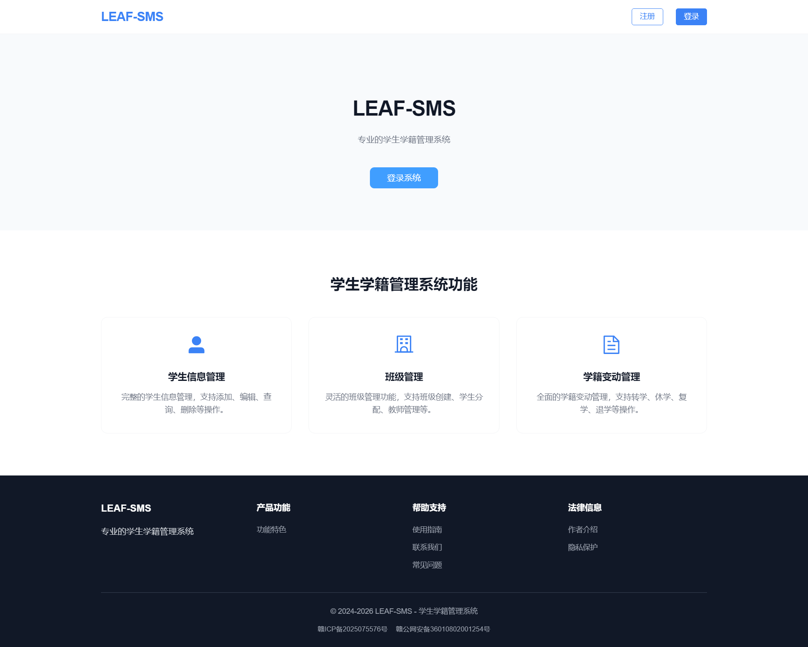
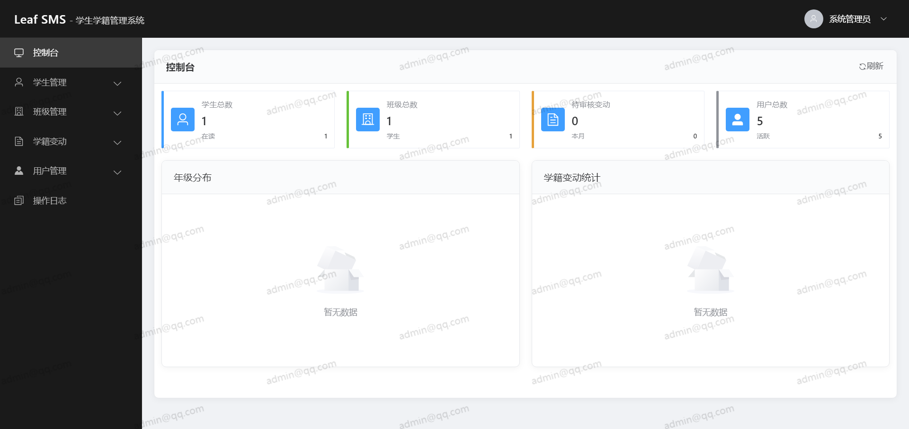
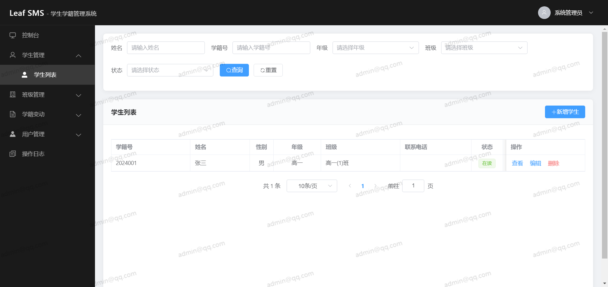
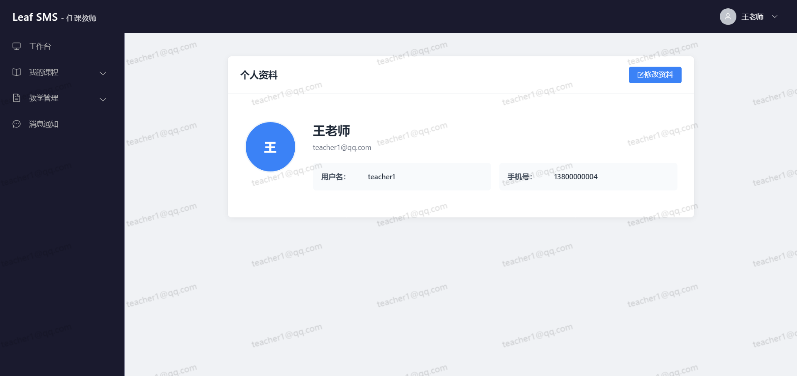
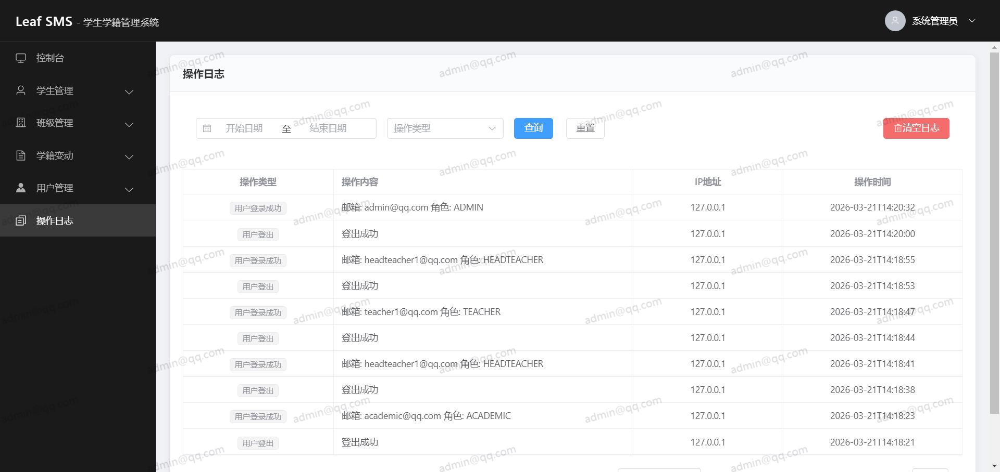

# Leaf SMS - 学生学籍管理系统

<div align="center">

[](https://github.com/YangShengzhou03/LeafSMS)&nbsp;[](https://github.com/YangShengzhou03/LeafSMS)&nbsp;[](https://github.com/YangShengzhou03/LeafSMS)&nbsp;[](https://vuejs.org/)&nbsp;[](https://spring.io/projects/spring-boot)&nbsp;[](https://www.mysql.com/)

**一个现代化的学生学籍管理系统，采用前后端分离架构**

[快速开始](#快速开始) • [功能特性](#功能特性) • [API文档](./API_DOCUMENTATION.md)

</div>

## 项目简介

Leaf SMS（Student Management System）是一个现代化的学生学籍管理系统，采用前后端分离架构，支持多终端浏览器访问，无需本地安装。

## 功能特性

### 系统界面展示


*系统首页*


*管理员控制台*


*学生管理页面*


*个人资料页面*


*操作日志页面*

### 核心功能

- **学生信息管理**：支持学生基本信息的增删改查、批量导入导出以及信息变更记录追踪
- **学籍变动管理**：支持转入转出、休学复学、毕业等变动类型的申请与审核流程
- **班级信息管理**：包括班级维护、班主任分配和学生人数统计
- **成绩管理**：支持成绩录入、统计分析以及按学生查询所有成绩记录
- **考勤管理**：提供考勤记录录入、状态管理和统计分析功能
- **消息管理**：实现消息收发、未读提醒和已读标记
- **用户权限管理**：基于 RBAC 模型，支持多角色权限控制和密码管理
- **操作日志审计**：记录所有关键操作，支持日志查询和安全追溯
- **数据统计分析**：提供学生统计、变动统计、成绩统计和考勤统计等多维度数据分析

## 快速开始

### Docker 部署

使用 Docker 手动部署，无需本地安装环境：

```bash
# 1. 创建网络
docker network create leafsms-network

# 2. 启动数据库（MariaDB）
docker run -d \
  --network leafsms-network \
  --restart always \
  --name leafsms-mysql \
  -e MYSQL_ROOT_PASSWORD=123456 \
  -e MYSQL_DATABASE=leaf_sms \
  -p 3306:3306 \
  mariadb:10.11

# 3. 初始化数据库（请确保 data.sql 文件在当前目录）
docker exec -i leafsms-mysql mysql -uroot -p123456 < data.sql

# 4. 启动后端
docker run -d --name leafsms-backend --network leafsms-network --restart always \
  -p 8081:8081 -e SPRING_DATASOURCE_URL=jdbc:mysql://leafsms-mysql:3306/leaf_sms \
  -e SPRING_DATASOURCE_USERNAME=root -e SPRING_DATASOURCE_PASSWORD=123456 \
  yangshengzhou/leafsms:backend-v1

# 5. 启动前端
docker run -d --name leafsms-frontend --network leafsms-network --restart always \
  -p 80:80 yangshengzhou/leafsms:frontend-v1
```

部署完成后访问：http://localhost

### 本地开发

如需本地开发，请确保已安装以下环境：

- Node.js 16.0+
- Java 17.0+
- MySQL 8.0+
- Maven 3.6+

#### 数据库初始化

```bash
mysql -u root -p < data.sql
```

#### 后端启动

```bash
cd backend && mvn spring-boot:run
```

后端服务将在 http://localhost:8081 启动

#### 前端启动

```bash
cd frontend && npm install && npm run serve
```

前端服务将在 http://localhost:8080 启动

### 默认账号

系统初始化后提供以下默认账号（建议首次登录后修改密码）：

| 邮箱 | 密码 | 角色 |
|--------|------|------|
| chenmh@qq.com | 123456 | 系统管理员 |
| liuxm@qq.com | 123456 | 教务管理员 |
| lixy@qq.com | 123456 | 班主任 |
| wangjg@qq.com | 123456 | 任课教师 |
| zhangwei@qq.com | 123456 | 家长 |

详细的 API 接口文档请查看 [API_DOCUMENTATION.md](./API_DOCUMENTATION.md)

## 常用 Docker 命令

```bash
# 查看容器状态
docker ps

# 查看容器日志
docker logs leafsms-backend
docker logs leafsms-frontend
docker logs leafsms-mysql

# 停止容器
docker stop leafsms-backend leafsms-frontend leafsms-mysql

# 启动容器
docker start leafsms-mysql leafsms-backend leafsms-frontend

# 删除容器
docker rm -f leafsms-backend leafsms-frontend leafsms-mysql
```

## 数据库设计

系统主要数据表及其功能说明：

| 表名 | 说明 |
|------|------|
| users | 用户表 - 存储系统用户基本信息和认证信息 |
| students | 学生信息表 - 存储学生基本信息和学籍信息 |
| classes | 班级信息表 - 存储班级基本信息和班主任信息 |
| student_changes | 学籍变动表 - 记录学生学籍变动申请和审核信息 |
| info_change_logs | 信息变更记录表 - 记录学生信息变更历史 |
| operation_logs | 操作日志表 - 记录系统关键操作日志 |
| grades | 成绩表 - 存储学生各科成绩信息 |
| attendance | 考勤表 - 存储学生考勤记录 |
| messages | 消息表 - 存储系统内部消息 |

## 开发指南

### 代码规范

- 遵循阿里巴巴 Java 开发手册
- 使用 ESLint 进行前端代码检查
- 提交信息遵循 Conventional Commits 规范

### 分支管理

- `main`：主分支，稳定版本
- `develop`：开发分支
- `feature/*`：功能分支
- `bugfix/*`：修复分支

## 许可证

本项目采用 MIT 许可证，详见 LICENSE 文件。
